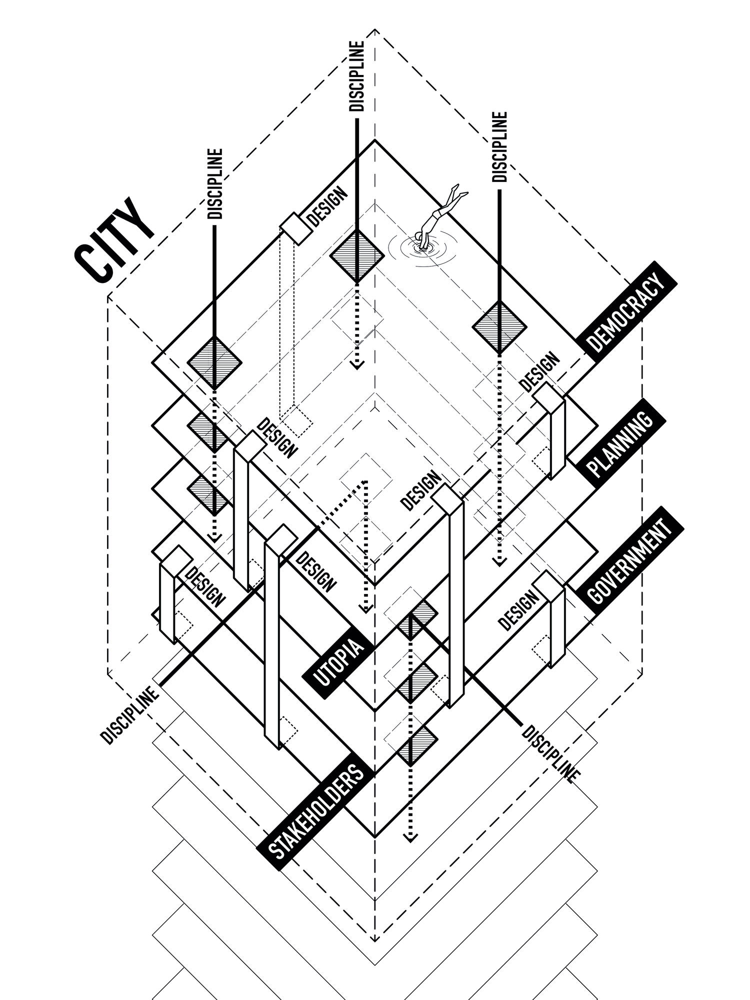
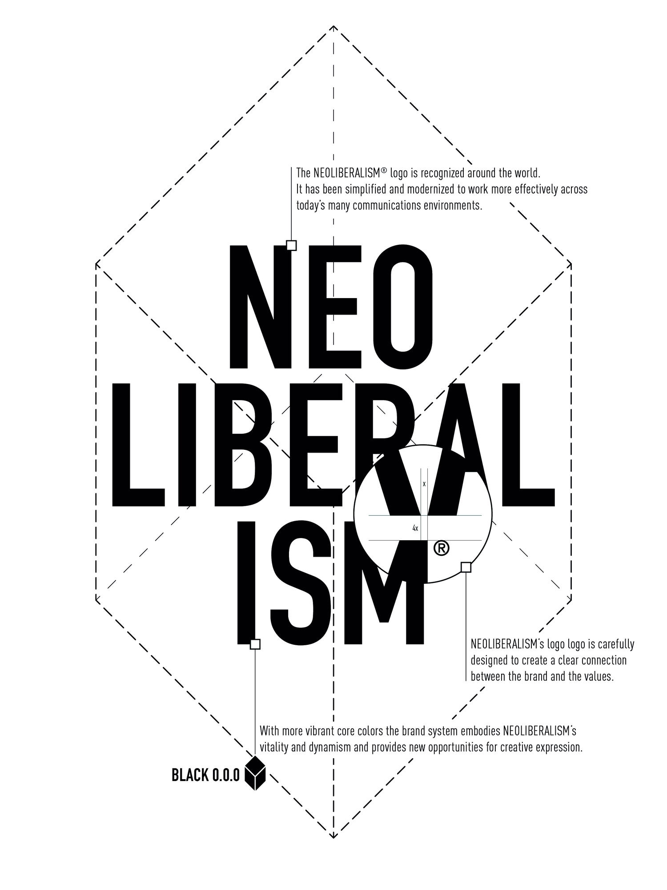

# Visual Framework

## Core Diagrams

### City as a Layer Framework

This isometric diagram illustrates the multidimensional nature of the research, showing how design operates across multiple layers and disciplines:

- **City** - The urban scale and spatial context
- **Stakeholders** - Community and institutional actors
- **Utopia** - Shared vision and aspirational outcomes
- **Design** - Design as the enabling methodology
- **Discipline** - Theoretical and methodological grounding
- **Democracy** - Participatory processes and governance
- **Planning** - Integration with urban planning
- **Government** - Institutional implementation

The interconnected structure shows how these dimensions work together to frame the legacy of participatory processes.

### Design System & Identity

The visual identity and design system specifications for the City as a Layer brand, including:
- Logo design and geometric construction
- Brand values and design principles
- Visual communication guidelines
- Color and typography specifications

## How to Use These Resources

These visual frameworks serve as:
- **Reference materials** for understanding the research dimensions
- **Communication tools** for presentations and publications
- **Design guidelines** for consistent brand representation
- **Educational resources** for training modules
